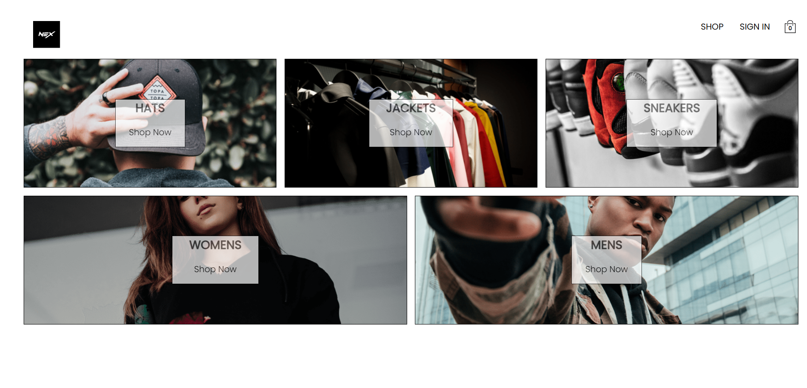
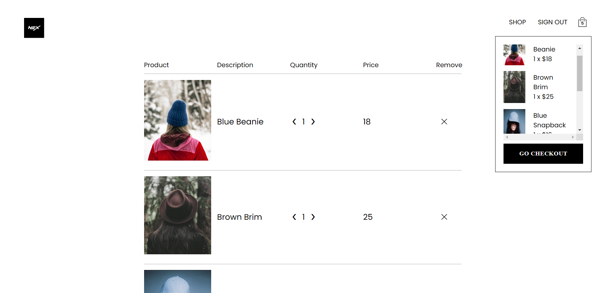
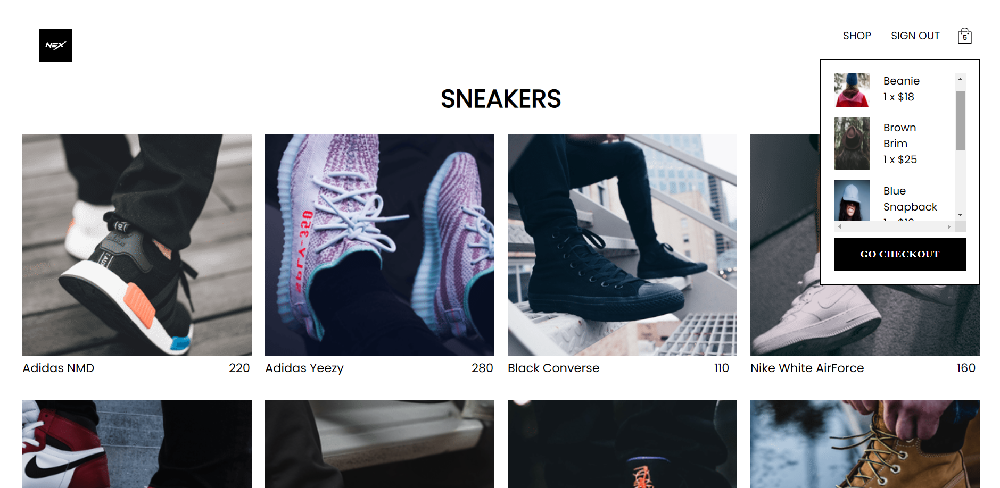

<<<<<<< HEAD
# Shop E-commerce Project
# Simple Project

NexShop 🛍️

This is an E-commerce project under development, created as part of the "Complete React Developer in 2024 (w/ Redux, Hooks, GraphQL): Zero to Mastery" course.

## Technologies Used

- Firebase for authentication and database storage
- React Context for managing application state
- React Router for routing and navigation between pages
- Redux for state management with a reducer (in progress)
=======
# NexShop 🛍️

Welcome to NexShop, your destination for all your online shopping needs! NexShop is a modern and stylish e-commerce project, currently under development, made with care and precision.

## Project presentation

Here's a look at some of the amazing visuals from our NexShop project:

## Technologies Used

NexShop is built using a number of cutting-edge technologies, including:

- **React:** JavaScript library for building user interface.

- **Redux:** Library for managing application state.

- **Firebase:** Google's web and mobile development platform, used for authentication and data storage.

- **React Router:** React component for routing.

- **TypeScript:** A superset of JavaScript that adds static types and other features to the language.

## Recent Changes

The latest changes to the project include:

- **User State Management:** Implementation of reduction and actions for user authentication management, including Google authentication, email authentication, registration and logout.

- **Shopping Cart Management:** Create discount and shopping cart management actions, including adding and removing items from the cart.
>>>>>>> 3f2d8a7766a7c1f49ba963394d6791da6c906e44
