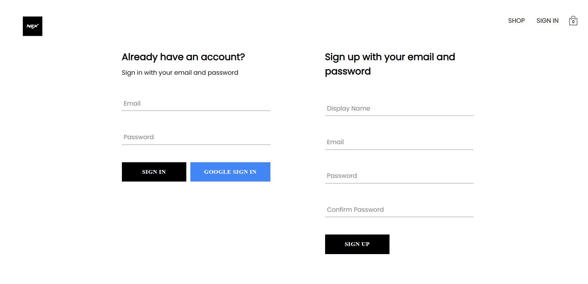

# NexShop 🛍️

Welcome to NexShop, your go-to destination for all your online shopping needs! NexShop is a modern and stylish E-commerce project currently under development, crafted with care and precision. 
## Project Showcase
Take a sneak peek at some of the stunning visuals from our NexShop project:

## Technologies & Features

NexShop is powered by cutting-edge technologies and boasts an impressive array of features:

- **Firebase Integration:** Seamlessly integrated Firebase for authentication and database storage, ensuring a secure and reliable user experience.
- **React Context:** Leveraged React Context API for efficient management of application-wide state, providing a smooth and responsive user interface.
- **React Router:** Implemented React Router for seamless navigation and routing between pages, ensuring a fluid browsing experience for users.
- **Redux State Management:** Utilized Redux for state management with a reducer (work in progress), enhancing scalability and maintainability of the application.
